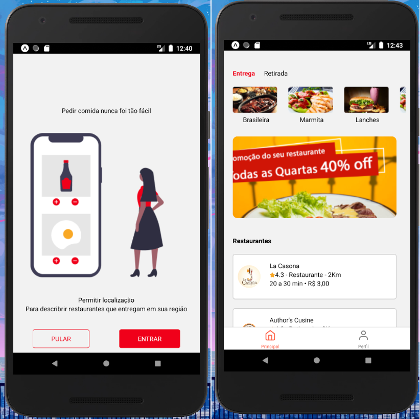

# Projeto: IFood Clone

Clone do app IFood

### Utilidade:

- Aprender a usar Expo.

#### Material:

- Styled Components
- React Native Vector Icons
- React Navigation
- Axios

#### Pré-requisitos

Antes de usar a aplicação, é ideal que você tenha o ambiente [Android](https://reactnative.dev/docs/environment-setup) configurado.

#### Modo de uso:

1. Abra um terminal ( cmd/propt de comando )
2. Clone o repositório ( git clone git@github.com:RobMota/iFoodClone.git ) em algum local de preferência
3. Acesse a pasta ( cd iFoodClone )
4. E digite o comando abaixo:

- `npm start`

#### Autor do projeto original:

- [Pablo Henrique](https://github.com/pablohdev)
